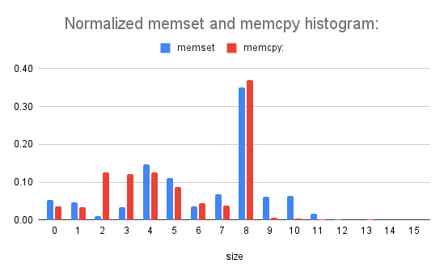

# memset_benchmark

This repository contains two fast memset implementations for x86. They both
outperform the glibc implementation.  The first implementation is 100 lines of C
code, and the other implementation is a short assembly function.

After reading a blog [post](https://msrc-blog.microsoft.com/2021/01/11/building-faster-amd64-memset-routines/)
by Joe Bialek, I decided to try to optimize memset. It turns out that the glibc
implementation is good, but it could be improved.

The chart below compares this code with the musl implementation and two libc
configurations (with and without elf indirection, as suggested by Dave
Zarzycki). The benchmark also shows the two memset implementations from this
project.


The chart below compares the performance of different memset implementations on
buffers of varying sizes and offsets. Unlike the hot loop that hammers a single
value, this benchmark is more realistic and takes into account mispredicted
branches and the performance of the cpu decoder. The buffers are in the size
range 0 to 256. The random function is made of pre-computed random values, to
lower the overhead of the random function.  This was suggested by Yann Collet
(@Cyan4973).


The size of the buffer that memset mutates is typically small. The picture below
presents the buffer length distribution as recorded in the google-chrome
program. Vim, Python, and even server workloads have a similar distribution. The
values in the chart represent the power of two buffer size (10 represents the
values 512 to 1024).
 



The repository also contains a few utilities for testing and measuring the
performance of memset.

## Test tool

This is a small test harness that verifies the correctness of memset. It's
really easy to make mistakes with off-by-one errors and run into alignment
issues. The exhaustive tester catches these issues.

This is a sample output:
```
OOOOOOOOOOOXX
           ^
Filling a buffer of length 13. Expected "O" at index 11
```

## Benchmark tool

The benchmark tool measures the performance of the system libc and the local
implementation. The benchmarking tool runs each of the implementations in a loop
millions of times. It runs the benchmark several times and picks the least noisy
results. It's a good idea to run the benchmark tool and compare the same
implementation to assess the noise level in the system. The benchmarking tool
uses a trampoline to prevent the compiler from inlining and expanding the
memset.


## Histogram tool

The histogram tool is a shared object that collects records calls to memset and
creates a histogram of the lengths of calls to memset. It prints the histogram
when the program exits cleanly. The shared object can be loaded using
LD\_PRELOAD (on Linux) or DYLD\_INSERT\_LIBRARIES (on Mac). Each bucket in the
output represents the log2 size of the buffer, and each value represents the
number of hits for the bucket.

Sample output:
```
  [0] = 4
  [1] = 14
  [2] = 8
  [3] = 14795
  [4] = 22496
  [5] = 10585
  [6] = 11176
  [7] = 5981
  [8] = 464
  [9] = 1044
  [10] = 137
  [11] = 55
  [12] = 18
  [13] = 12
  [14] = 15
  [15] = 5
  [16] = 2
  [17] = 2
  [18] = 0
  ```

## Proxy tool

This is a small utility that swaps the builtin call to memset with the local
implementation of memset from this project. .  The shared object can be loaded
using LD\_PRELOAD (on Linux) or DYLD\_INSERT\_LIBRARIES (on Mac).

